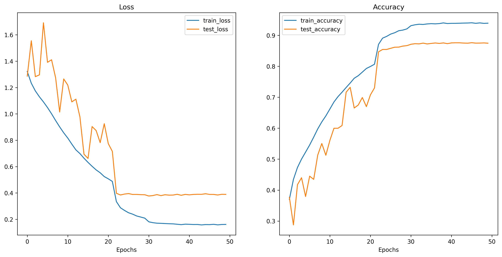
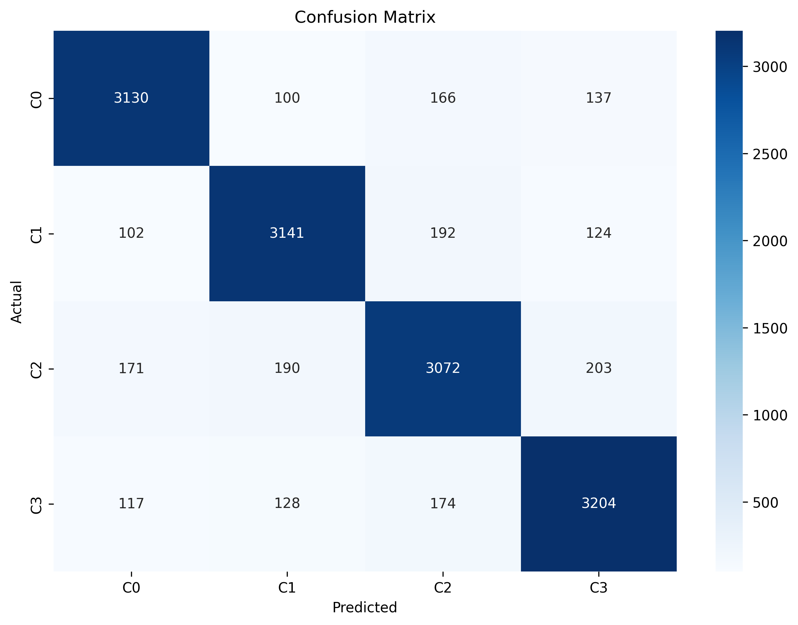

# HSI Wave Patches - Mycotoxin Detection

Toolkit for hyperspectral image processing using wavelet transforms for patch extraction and deep learning classification, specifically designed for fig mycotoxin detection.

## 📋 Overview

This project implements a complete pipeline for processing hyperspectral images (HSI) using wavelet transforms to extract meaningful patches for machine learning classification, with a specific focus on **fig mycotoxin detection**. The workflow includes wavelet-based feature extraction, patch generation, data splitting, and convolutional neural network training to identify mycotoxin contamination levels in fig samples.

## 🔧 Features

- **Wavelet Transform Processing**: Supports both Continuous Wavelet Transform (CWT) and Discrete Wavelet Transform (DWT)
- **Intelligent Patch Extraction**: Automatically finds optimal patch positions in hyperspectral images
- **Multi-Class Classification**: CNN-based classification with support for multiple mycotoxin contamination levels (C0, C1, C2, C3)

## 🛠️ Installation

This project uses Python 3.13+ and is managed with `uv`. Make sure you have `uv` installed:

```bash
# Install uv if you haven't already
curl -LsSf https://astral.sh/uv/install.sh | sh

# Clone the repository
git clone <repository-url>
cd hsi-wave-patches

# Install dependencies
uv sync
```

### Dependencies

- **Core Libraries**: NumPy, Pandas, Matplotlib, Seaborn
- **Image Processing**: OpenCV, scikit-image
- **Wavelet Processing**: PyWavelets
- **Machine Learning**: scikit-learn, PyTorch, TorchVision
- **Utilities**: TorchInfo, TorchMetrics, TorchEval

## 📁 Project Structure

```
hsi-wave-patches/
├── data/
│   ├── raw/                    # Original hyperspectral .npy files (fig samples)
│   │   ├── C0/                 # No contamination samples
│   │   ├── C1/                 # Low mycotoxin contamination
│   │   ├── C2/                 # Medium mycotoxin contamination
│   │   └── C3/                 # High mycotoxin contamination
│   ├── interim/                # Processed wavelet transforms
│   │   └── CWT_morl/          # Morlet CWT results
│   └── processed/              # Train/test split data
│       ├── train/             # Training dataset
│       └── test/              # Testing dataset
├── cnn/
│   ├── train.py               # Main training script
│   ├── engine.py              # Training/testing engine
│   ├── models/                # Model architectures
│   └── util/
│       └── helper_functions.py # Utility functions
├── create_wavelets.py         # Wavelet transform processing
├── split.py                   # Dataset splitting utility
├── inspect_dataset.py         # Dataset analysis tool
└── pyproject.toml            # Project configuration
```

## 🚀 Usage

### Wavelet Transform Processing

The wavelet processing pipeline extracts meaningful features from hyperspectral images by applying Continuous Wavelet Transform (CWT) with Morlet wavelets to spectral signatures. The process extracts 32×32 pixel patches from the original hyperspectral images, then divides each patch into 64 sub-patches of 4×4 pixels. For each sub-patch, the mean spectral signature across all pixels is calculated and transformed using CWT to create scalogram representations. This approach reduces dimensionality while preserving important spectral-spatial relationships, generating 64 wavelet-transformed feature maps per original patch that capture frequency content across different spectral bands.

```bash
uv run create_wavelets.py
```

### Model Training

Train a CNN classifier on the processed data:

```bash
uv run cnn/train.py
```

## 🎯 Experimental Results

**Model Configuration:**
- **Architecture**: DenseNet with custom classifier
- **Total Parameters**: 7,093,828
- **Training Epochs**: 50
- **Batch Size**: 64
- **Learning Rate**: 0.001
- **Training Time**: 11,205.84 seconds (~3.1 hours)

### Training Results



### Confusion Matrix



### Classification Report

|FIELD1      |precision         |recall            |f1-score          |support           |
|------------|------------------|------------------|------------------|------------------|
|C0          |0.8892045454545454|0.8859326351542598|0.8875655749326528|3533.0            |
|C1          |0.8825512784490025|0.8825512784490025|0.8825512784490025|3559.0            |
|C2          |0.8523862375138734|0.8448844884488449|0.8486187845303867|3636.0            |
|C3          |0.8735005452562704|0.8843499861992824|0.8788917843917158|3623.0            |
|accuracy    |0.8742944742526653|0.8742944742526653|0.8742944742526653|0.8742944742526653|
|macro avg   |0.8744106516684229|0.8744295970628474|0.8744068555759396|14351.0           |
|weighted avg|0.8742616189920438|0.8742944742526653|0.8742646513581448|14351.0           |

### 📋 License
This project is part of ongoing research. Please contact me for usage permissions and cite appropriately in academic work.

### 📬 Contact
For research collaboration or technical questions, please open an issue with detailed information.